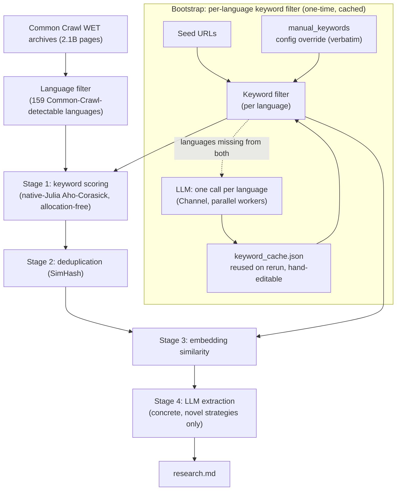

<p align="center">
  
</p>

# MonsieurPapin

[](https://D3MZ.github.io/MonsieurPapin.jl/stable/)
[](https://D3MZ.github.io/MonsieurPapin.jl/dev/)
[](https://github.com/D3MZ/MonsieurPapin.jl/actions/workflows/CI.yml?query=branch%3Amain)
[](https://codecov.io/gh/D3MZ/MonsieurPapin.jl)

> A French Huguenot physicist, mathematician and inventor, best known for his pioneering invention of the steam digester, the forerunner of the pressure cooker, the steam engine, the centrifugal pump, and a submersible boat. — [Wikipedia](https://en.wikipedia.org/wiki/Denis_Papin)

This ain't your ordinary digester: Search the entire internet, filter, extract, reduce, and summarize into a "research grade" markdown file on your computer in a day or your money back :P

> [!IMPORTANT]
> MonsieurPapin is in active pre-release development. See [TODO](TODO.md) before running long crawls.

## Performance Benchmarks

Measured with Julia 1.12 on a 21,465-page WET sample from the February 2026 Common Crawl archive (2.1 billion pages, 5.96 TiB compressed), serial numbers single-threaded, on two machines:

- **2021 Apple M1 Max** — 32 GB (10-core, 8 performance)
- **2017 Apple MacBook Pro, Intel Core i7-7567U** — 16 GB (2-core / 4-thread)

Complexity columns use **N** = pages streamed, **L** = content bytes per page (capped at 12 KB), **C** = shortlist capacity, **P** = worker threads, **K** = keywords in the matcher (total length **M** bytes).

| Stage | M1 Max | Core i7-7567U | Heap allocs added | Big-O serial | Big-O parallel |
| --- | --- | --- | --- | --- | --- |
| WET record parsing | 27,400 records/s | 20,200 records/s | 0/record ✦ | O(N·L) | O(N·L / P) |
| Aho-Corasick keyword scoring (native Julia) | 25,600 records/s | 18,700 records/s ✱ | 0/record ✦ | O(N·L) ‡ | O(N·L / P) ‡ |
| SimHash deduplication | 7,400 records/s | 9,100 records/s | 0/record | O(N·L) | O(N·L / P) |
| Model2Vec embedding scoring (native Julia) | ~5,360 records/s | — | ~3.25/record ✧ | O(N·L) | O(N·L / P) |
| Queue insert (top 1K) | 27,400 records/s | 19,200 records/s | 0/record steady | O(N·log C) | O(N·log C) † |
| Queue pop! extraction | 811,000 pops/s | 583,000 pops/s | 1/pop | O(C·log C) | O(C·log C) † |
| LLM extraction | ~0.1 pages/s | — | — | O(C) | O(C) † |

Waterfall: each stage only sees the top candidates from the previous stage.

Measured 8-thread scaling: deduplication **7.2×** (9,900 → 71,900 records/s), multi-file parsing **3.6×** (24,900 → 90,300 records/s, bandwidth-bound).

Native-Julia kernels vs Rust, same dataset:

| Kernel | vs Rust | Allocs (Julia vs Rust) |
| --- | --- | --- |
| [AhoCorasickILP.jl](https://github.com/D3MZ/AhoCorasickILP.jl) match kernel | **3.44×** faster (50.3 ms vs 173.2 ms, identical counts) | 0 vs 39,398 |
| [Model2Vec.jl](https://github.com/D3MZ/Model2Vec.jl) vs retired Rust FFI bridge | **8.95×** faster, 0.9999999 score correlation | 0 (hot path) vs 3/call |
| Model2Vec.jl vs no-FFI Rust reference, identical algorithm | **1.62×–3.20×** across both tokenizer families | — |

`†` serial: queue mutates under one lock; LLM stage drains single-consumer.

`✱` Extrapolated (machine mid-crawl): prior 15,200 records/s × 1.23 pipeline speedup.

`✦` ~60 one-time stream-setup allocations total; 0/record steady over all 21,465 records.

`✧` Not the encoder (Model2Vec.jl's encode is 0-alloc): 2/record zero-copy `StringView` in this repo's WET wrapper + ~1.25/record amortized invalid-UTF-8 sanitized-copy fallback (~4.8% of records).

`‡` Independent of keyword count K: one state transition per input byte regardless of automaton size; adding keywords costs only a one-time O(M) build.

Reproduce with [test/benchmarks.jl](test/benchmarks.jl).

## Quick Start

### Prerequisites

- [Julia 1.12+](https://julialang.org/downloads/)
- A local OpenAI-compatible chat server, such as [LM Studio](https://lmstudio.ai/)
- About 200 MB of disk space for the embedding model, downloaded on first run

A Rust toolchain is **not** required to run a crawl — keyword and embedding scoring both run
on native Julia ([AhoCorasickILP.jl](https://github.com/D3MZ/AhoCorasickILP.jl),
[Model2Vec.jl](https://github.com/D3MZ/Model2Vec.jl)). It's only needed to reproduce the Rust-FFI
comparison in [test/benchmarks.jl](test/benchmarks.jl)'s head-to-head tests — see
`deps/model2vec_rs_worker`.

Load a local chat model in your OpenAI-compatible server, for example `qwen/qwen3.6-27b`, and start it on port `1234`.

### Run a Crawl

```bash
git clone https://github.com/D3MZ/MonsieurPapin.jl
cd MonsieurPapin.jl

julia --project example.jl
```

The pipeline will:

- Bootstrap from seed URLs, asking the LLM for multilingual keywords and a semantic query
- Download the configured Common Crawl WET archive index
- Stream and decompress WET files
- Score pages by weighted keyword match
- Score candidates by embedding similarity
- Send shortlisted pages to the configured LLM
- Append extracted findings to `research.md`

### Configure

Edit `settings.toml` at the package root — all defaults live there including prompts, LLM connection, crawl source, and pipeline parameters.

The LLM integration uses the OpenAI-compatible `/v1/chat/completions` endpoint and supports structured output via JSON schema (`response_format`). It works with LM Studio and any OpenAI-compatible server.

For better local throughput, run Julia with more threads:

```bash
export JULIA_NUM_THREADS=auto
julia --project example.jl
```

## Architecture

MonsieurPapin is a fixed-capacity waterfall. Each stage keeps the best candidates it has seen, and the next stage pulls from that shortlist. Cheap stages reduce the search space before expensive stages run.



**Key principles**: bounded priority queues evict the lowest-ranked candidate when full; expensive stages process the best survivors from the previous stage; near-duplicates within a SimHash window are dropped from the keyword shortlist before the expensive embedding and extraction stages. The **keyword filter is built per language** from three sources in priority order — a `manual_keywords` config override (used verbatim), a `keyword_cache.json` of previously-generated terms (so reruns skip the build and the file can be hand-edited), and otherwise one LLM call per language fanned out over a Channel (worker count = `llm.parallel`); the assembled vocabulary feeds both the keyword matcher and the embedding query.
