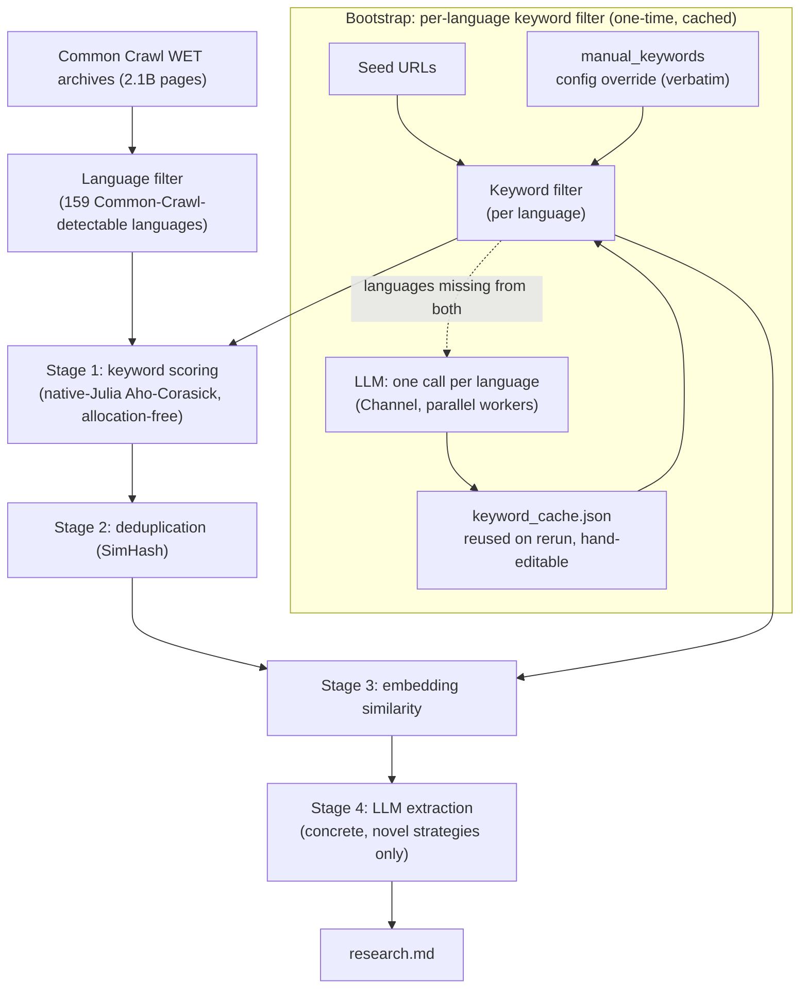

<p align="center">
  
</p>

# MonsieurPapin

[](https://D3MZ.github.io/MonsieurPapin.jl/stable/)
[](https://D3MZ.github.io/MonsieurPapin.jl/dev/)
[](https://github.com/D3MZ/MonsieurPapin.jl/actions/workflows/CI.yml?query=branch%3Amain)
[](https://codecov.io/gh/D3MZ/MonsieurPapin.jl)

> A French Huguenot physicist, mathematician and inventor, best known for his pioneering invention of the steam digester, the forerunner of the pressure cooker, the steam engine, the centrifugal pump, and a submersible boat. — [Wikipedia](https://en.wikipedia.org/wiki/Denis_Papin)

This ain't your ordinary digester: Search the entire internet, filter, extract, reduce, and summarize into a "research grade" markdown file on your computer in a day or your money back :P

> [!IMPORTANT]
> MonsieurPapin is in active pre-release development. See [TODO](TODO.md) before running long crawls.

## Performance Benchmarks

Measured with Julia 1.12 on a 21,465-page WET sample from the February 2026 Common Crawl archive (2.1 billion pages, 5.96 TiB compressed), serial numbers single-threaded, on two machines:

- **2021 Apple M1 Max** — 32 GB (10-core, 8 performance)
- **2017 Apple MacBook Pro, Intel Core i7-7567U** — 16 GB (2-core / 4-thread)

Complexity columns use **N** = pages streamed, **L** = content bytes per page (capped at 12 KB), **C** = shortlist capacity, **P** = worker threads, **K** = keywords in the matcher (total length **M** bytes).

| Stage | M1 Max | Core i7-7567U | Heap allocs | Big-O serial | Big-O parallel |
| --- | --- | --- | --- | --- | --- |
| WET record parsing | 23,500 records/s | 20,200 records/s | 4/record ✦ | O(N·L) | O(N·L / P) |
| Aho-Corasick keyword scoring (native Julia) | 23,300 records/s | 18,700 records/s ✱ | 4/record ✦ | O(N·L) ‡ | O(N·L / P) ‡ |
| SimHash deduplication | 7,300 records/s | 9,100 records/s | 0/record | O(N·L) | O(N·L / P) |
| Model2Vec embedding scoring (native Julia) | ~5,365 records/s | — | ~3.25/record ✧ | O(N·L) | O(N·L / P) |
| Queue insert (top 1K) | 23,000 records/s | 19,200 records/s | 0/record steady | O(N·log C) | O(N·log C) † |
| Queue pop! extraction | 925,000 pops/s | 583,000 pops/s | 1/pop | O(C·log C) | O(C·log C) † |
| LLM extraction | ~0.1 pages/s | — | — | O(C) | O(C) † |

As a waterfall, each stage only processes the top candidates from the previous stage — the pipeline doesn't need to run every page through every stage.

The four streaming stages are embarrassingly parallel per record (`O(N·L / P)`); `†` marks stages that stay serial — the queue mutates under a single lock and the LLM stage drains single-consumer (multiple consumers is a TODO), so it's the scoring that feeds them that parallelizes. These parallel bounds hold in practice on 8 threads: deduplication **7.2×** (9,900 → 71,900 records/s, near-linear since only the seen-set check is locked) and multi-file parsing **3.6×** (24,900 → 90,300 records/s, bounded by bandwidth as workers overlap per-file I/O and decompression).

Keyword scoring runs on [**AhoCorasickILP.jl**](https://github.com/D3MZ/AhoCorasickILP.jl) — a native-Julia, allocation-free Aho-Corasick matcher — replacing the previous Rust `aho-corasick` FFI. On the raw match kernel over this dataset it is **3.44× faster than the Rust crate (50.3 ms vs 173.2 ms, identical counts, 0 vs 39,398 allocations)**; end-to-end the scoring stage is streaming-bound, so the full-pipeline throughput above rises a more modest ~1.23× and the stage is now nearly as fast as raw WET parsing. The speedup comes from a byte-class/premultiplied DFA plus a single-thread multi-stream ILP kernel (interleaved independent DFA chains that hide the dependent-load latency — not multithreading).

Embedding scoring runs on [**Model2Vec.jl**](https://github.com/D3MZ/Model2Vec.jl) — a native-Julia model2vec tokenizer + pooler (WordPiece and Unigram/SentencePiece) — replacing the previous in-process Rust FFI bridge (`RustWorker.jl` / `deps/model2vec_rs_worker`, no longer required to build the project). Head-to-head over this same dataset (`potion-multilingual-128M`, Unigram tokenizer, see [test/benchmarks.jl](test/benchmarks.jl)'s "Model2Vec head-to-head" test) it is **8.95× faster than the Rust FFI bridge it replaced, with 0.9999999... score correlation** (Core i7-7567U not yet remeasured on this backend — mid-crawl and unavailable, hence the `—` above). Model2Vec.jl's Unigram backend implements SentencePiece's `Precompiled` charsmap normalizer byte-for-byte (a darts double-array trie decoded from the model's own tokenizer.json, rather than approximating it with generic Unicode normalization) and walks its vocabulary through a second darts double-array trie built at load time — the ~3.25/record above is entirely this repo's WET-record wrapper (see footnote `✧`), and Model2Vec.jl's own isolated hot path hits true zero allocations; see [Model2Vec.jl's README](https://github.com/D3MZ/Model2Vec.jl#readme) for the full writeup. Versus a fair, no-FFI-overhead Rust reference running the identical algorithm (Model2Vec.jl's own benchmark, not the FFI bridge above), Model2Vec.jl now measures **1.62×–3.20×** across both tokenizer families — so the 8.95× here is a mix of a genuine algorithmic win and FFI/ccall crossing overhead Rust was paying that Julia doesn't, but the algorithm itself now leads Rust too, not just the in-process comparison.

`✱` Core i7-7567U figure for this row is **extrapolated, not measured**: that machine is mid-crawl and unavailable, so its prior 15,200 records/s is scaled by the M1 Max full-pipeline speedup from this change (×1.23). To be replaced with a measured value.

`✦` The matcher itself is **allocation-free**: scoring pre-parsed records measures 0 allocations over the full 21,465-record sample (versus 3 per call for the former Rust FFI). The 4/record in both rows is the same steady per-record cost of iterating the gzip WET stream (~430 bytes/record); keyword scoring adds nothing on top of parsing.

`✧` Model2Vec.jl's encode hot path is allocation-free in isolation (see its README). The ~3.25/record is this repo's WET wrapper: 2/record building the zero-copy `StringView` over the record's inline content, plus ~1.25/record amortized from the ~4.8% of crawled records with invalid interior UTF-8, which fall back to an allocating sanitized copy before encoding.

`‡` Aho-Corasick keyword scoring is **independent of the keyword count K**: the automaton makes one state transition per input byte whether it holds 50 keywords or 50,000, so scan throughput does not change as the keyword set grows. The `O(N·L)` cost above already includes matching every keyword at once. Adding keywords costs only a one-time `O(M)` automaton build at startup and proportional automaton memory — never scan time. (`N·L` itself is the upper bound; the waterfall only ever scans the pages the earlier stages admit.)

Allocation counts are what scale to a full crawl. Header parsing reads into a reused buffer rather than allocating per line, so the per-record figures above are a small, constant stream-iteration cost (~430 bytes/record), not growth: heap pressure stays flat across billions of pages because nothing accumulates per record.

See [test/benchmarks.jl](test/benchmarks.jl) for how to reproduce these numbers.

## Quick Start

### Prerequisites

- [Julia 1.12+](https://julialang.org/downloads/)
- A local OpenAI-compatible chat server, such as [LM Studio](https://lmstudio.ai/)
- About 200 MB of disk space for the embedding model, downloaded on first run

A Rust toolchain is **not** required to run a crawl — keyword and embedding scoring both run
on native Julia ([AhoCorasickILP.jl](https://github.com/D3MZ/AhoCorasickILP.jl),
[Model2Vec.jl](https://github.com/D3MZ/Model2Vec.jl)). It's only needed to reproduce the Rust-FFI
comparison in [test/benchmarks.jl](test/benchmarks.jl)'s head-to-head tests — see
`deps/model2vec_rs_worker`.

Load a local chat model in your OpenAI-compatible server, for example `qwen/qwen3.6-27b`, and start it on port `1234`.

### Run a Crawl

```bash
git clone https://github.com/D3MZ/MonsieurPapin.jl
cd MonsieurPapin.jl

julia --project example.jl
```

The pipeline will:

- Bootstrap from seed URLs, asking the LLM for multilingual keywords and a semantic query
- Download the configured Common Crawl WET archive index
- Stream and decompress WET files
- Score pages by weighted keyword match
- Score candidates by embedding similarity
- Send shortlisted pages to the configured LLM
- Append extracted findings to `research.md`

### Configure

Edit `settings.toml` at the package root — all defaults live there including prompts, LLM connection, crawl source, and pipeline parameters.

The LLM integration uses the OpenAI-compatible `/v1/chat/completions` endpoint and supports structured output via JSON schema (`response_format`). It works with LM Studio and any OpenAI-compatible server.

For better local throughput, run Julia with more threads:

```bash
export JULIA_NUM_THREADS=auto
julia --project example.jl
```

## Architecture

MonsieurPapin is a fixed-capacity waterfall. Each stage keeps the best candidates it has seen, and the next stage pulls from that shortlist. Cheap stages reduce the search space before expensive stages run.



**Key principles**: bounded priority queues evict the lowest-ranked candidate when full; expensive stages process the best survivors from the previous stage; near-duplicates within a SimHash window are dropped from the keyword shortlist before the expensive embedding and extraction stages. The **keyword filter is built per language** from three sources in priority order — a `manual_keywords` config override (used verbatim), a `keyword_cache.json` of previously-generated terms (so reruns skip the build and the file can be hand-edited), and otherwise one LLM call per language fanned out over a Channel (worker count = `llm.parallel`); the assembled vocabulary feeds both the keyword matcher and the embedding query.
