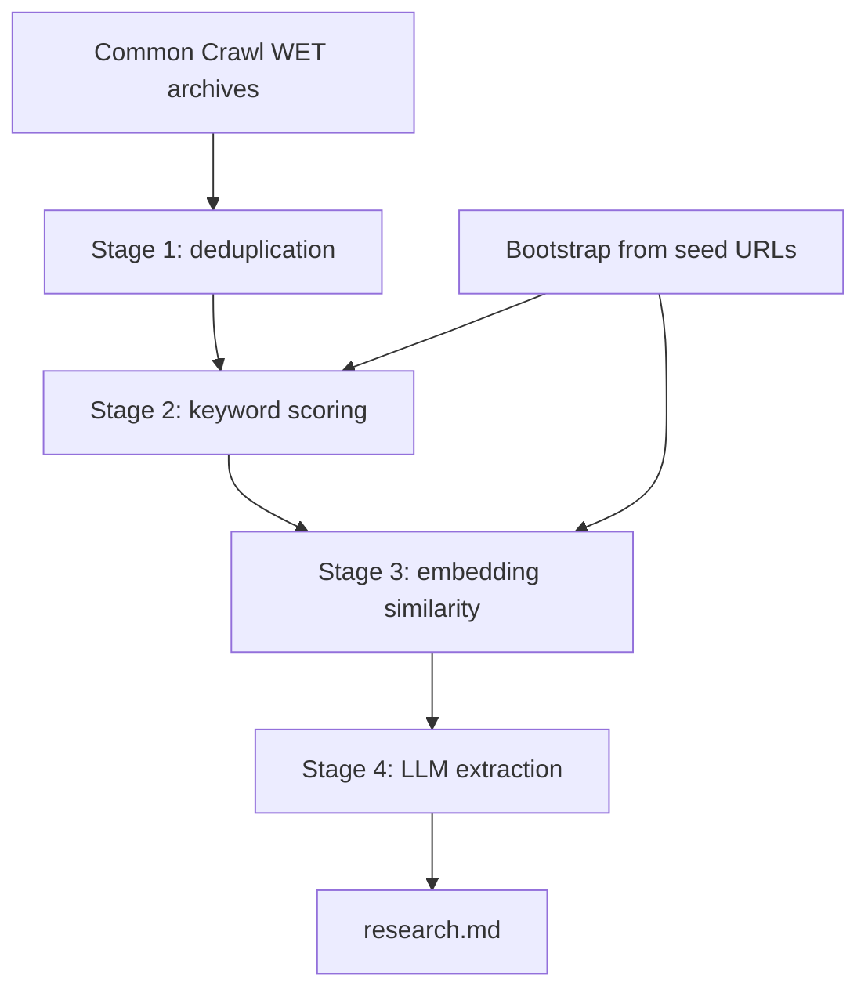

<p align="center">
  
</p>

# MonsieurPapin

[](https://D3MZ.github.io/MonsieurPapin.jl/stable/)
[](https://D3MZ.github.io/MonsieurPapin.jl/dev/)
[](https://github.com/D3MZ/MonsieurPapin.jl/actions/workflows/CI.yml?query=branch%3Amain)

MonsieurPapin is an experimental Julia research pipeline for searching Common Crawl, ranking relevant pages through progressively more expensive stages, and writing LLM-extracted findings to `research.md`.

> A French Huguenot physicist, mathematician and inventor, best known for his pioneering invention of the steam digester, the forerunner of the pressure cooker, the steam engine, the centrifugal pump, and a submersible boat. — [Wikipedia](https://en.wikipedia.org/wiki/Denis_Papin)

This ain't your ordinary digester: Search the entire internet, filter, extract, reduce, and summarize into a "research grade" markdown file on your computer in a matter of weeks… Hopefully!

> [!IMPORTANT]
> MonsieurPapin is in active pre-release development. This README describes both the current implementation and the target queued pipeline. See [Current Status](#current-status) and [TODO](TODO.md) before running long crawls.

## Current Status

| Area | Status |
| --- | --- |
| WET parsing | Implemented |
| Rust Aho-Corasick scoring | Implemented |
| Model2Vec embedding scoring | Implemented |
| LLM extraction | Implemented |
| Realtime `research.md` output | Implemented |
| Full queued waterfall architecture | In progress |
| Cross-machine release validation | Not started |

Public release checklist:

- [ ] 0/8 full searches completed
- [ ] 0/5 machines tested
- [ ] 0/3 major OSs tested: Windows, macOS, Linux
- [ ] Multilingual source searches confirmed

## Quick Start

### Prerequisites

- [Julia 1.12+](https://julialang.org/downloads/)
- Rust toolchain
- A local OpenAI-compatible chat server, such as [LM Studio](https://lmstudio.ai/)
- About 200 MB of disk space for the embedding model, downloaded on first run

Install Rust if needed:

```bash
curl --proto '=https' --tlsv1.2 -sSf https://sh.rustup.rs | sh
```

Load a local chat model in your OpenAI-compatible server, for example `qwen/qwen3.6-27b`, and start it on port `1234`.

### Run a Crawl

```bash
git clone https://github.com/D3MZ/MonsieurPapin.jl
cd MonsieurPapin.jl

cargo build --release --manifest-path deps/model2vec_rs_worker/Cargo.toml

julia --project example.jl
```

The pipeline will:

- Bootstrap from seed URLs, asking the LLM for multilingual keywords and a semantic query
- Download the configured Common Crawl WET archive index
- Stream and decompress WET files
- Score pages by weighted keyword match
- Score candidates by embedding similarity
- Send shortlisted pages to the configured LLM
- Append extracted findings to `research.md`

### Configure

Edit `config.toml` at the package root — all defaults live there:

```toml
outputpath = "research.md"

[crawl]
crawlpath = "https://data.commoncrawl.org/crawl-data/CC-MAIN-2026-08/wet.paths.gz"
crawlroot = "https://data.commoncrawl.org/"
languages = ["eng"]

[llm]
baseurl = "http://localhost:1234"
path = "/api/v1/chat"
model = "qwen/qwen3.6-27b"
```

Prompt text lives in `prompts/` — edit `system.txt` and `input.txt` to change what the LLM extracts without touching code.

For better local throughput, run Julia with more threads:

```bash
export JULIA_NUM_THREADS=auto
julia --project example.jl
```

## Concept

MonsieurPapin is designed as a fixed-capacity waterfall. Each stage keeps only the best candidates it has seen, then the next stage pulls from that shortlist. Cheap stages reduce the search space before expensive stages run.



The target flow has two phases:

1. **Bootstrap**: fetch seed URLs, ask an LLM for multilingual keywords and a semantic query, then seed the keyword and embedding stages.
2. **Waterfall**: stream Common Crawl and move candidates through deduplication, keyword, embedding, and LLM queues.

## Target Architecture

Every stage is intended to be a bounded priority queue:

| Stage | Purpose | Ranking signal | Target capacity |
| --- | --- | --- | --- |
| 1. Deduplication | Prefer original content over near-duplicates | SimHash uniqueness | 100K |
| 2. Keyword | Keep pages with the strongest domain keyword matches | Aho-Corasick score | 100K |
| 3. Embedding | Keep pages closest to the semantic query | Model2Vec cosine distance | 1K |
| 4. LLM | Extract useful research findings | LLM relevance judgment | Consumer-bound |

Key principles:

- **Bounded queues, not unbounded streams**: each stage evicts lower-ranked candidates when full.
- **Pull from the best candidate**: expensive stages process the best survivors from the previous stage.
- **Soft deduplication**: near-duplicates should compete, not be dropped solely because they appear later.
- **Multilingual search**: keyword generation and embeddings should work across Common Crawl languages.
- **Local-first extraction**: LLM calls use an OpenAI-compatible API endpoint, so local servers can be used.

## Current Implementation

The main runnable entry point is `example.jl`. It demonstrates the broader four-stage shape, including bootstrap and deduplication, with weighted Aho-Corasick terms, embedding scoring, a `WETQueue` shortlist, and LLM extraction.

Important current gaps:

- Keyword harvest is still a streaming threshold filter in the main path, not a fixed-capacity competing queue.
- `semantic()` in `src/core.jl` drains its candidate channel before returning.
- Bootstrap JSON parsing is fragile when the LLM wraps JSON in markdown or extra reasoning text.

## What to Expect

- The first keyword candidate should usually appear within about 40 seconds.
- The first LLM extraction request should follow shortly after semantic scoring begins.
- Progress bars show WET file progress and page counts.
- `research.md` grows while the crawl is running.
- A full crawl can take days on typical home broadband.

## Models

| Model | Type | Loading |
| --- | --- | --- |
| `minishlab/potion-multilingual-128M` | Embedding | Downloaded by the Rust worker on first use |
| Any OpenAI-compatible chat model | Extraction | Served separately at `baseurl` + `path` |

## Project Layout

| Path | Purpose |
| --- | --- |
| `config.toml` | Default configuration (crawl, search, llm, prompt) |
| `prompts/` | System prompt and LLM input template files |
| `src/core.jl` | Settings struct, bootstrap, harvest, semantic orchestration |
| `src/scoring.jl` | Relevance scoring helpers |
| `src/queue.jl` | Fixed-capacity `WETQueue` |
| `src/wets.jl` | WET record parsing |
| `src/simhash.jl` | SimHash and deduplication support |
| `src/RustWorker.jl` | Julia bindings for Rust scoring worker |
| `deps/model2vec_rs_worker/` | Rust Aho-Corasick and Model2Vec worker |
| `example.jl` | Primary entry point — bootstrap + waterfall pipeline |
| `test/` | Unit and integration tests |

## Design Notes

- **Zero-allocation WET parsing**: WARC records are parsed into fixed-size structs.
- **Rust FFI for hot paths**: keyword matching and embedding similarity run outside Julia.
- **Language-aware filtering**: `WARC-Identified-Content-Language` is used to skip unsupported languages.
- **Realtime output**: extracted findings are appended as the crawl runs.
- **OpenAI-compatible API**: extraction works with local or remote chat servers that expose a compatible endpoint.

## Known Issues

1. **Thread count defaults to 1**

   Set `JULIA_NUM_THREADS=auto` or a specific thread count before running long crawls.

2. **Bootstrap JSON parsing is brittle**

   `stripjson()` uses a simple first-brace to last-brace fallback. Markdown fences and reasoning blocks can break parsing.

3. **The library `semantic()` helper blocks**

   `semantic(config, entries)` drains all candidates before returning a queue. The live scripts work around this with a more direct waterfall dispatch pattern.

4. **The target queue architecture is not fully wired**

   The current main path still sends too many keyword-passing pages into embedding scoring.

